<p align="center">
  
</p>

<p align="center">
  
  
  
  
  
</p>

<h1 align="center">OpenSky Radar Pipeline</h1>

<p align="center">
  A scheduled Airflow pipeline that ingests live flight-state data from the
  OpenSky Network API, lands it in S3, flows it through a Bronze / Silver /
  Gold Snowflake architecture, and serves business-ready flight analytics
  through a Streamlit dashboard.
</p>

<p align="center">
  
  
  
</p>

---

## Overview

This project polls the [OpenSky Network API](https://opensky-network.org/api/states/all)
for live aircraft state vectors, archives the raw responses to S3, and
loads them through a three-layer Snowflake architecture — **Bronze**
(raw), **Silver** (cleaned and standardized), and **Gold** (business-ready
aggregates) — with the Gold layer powering a Streamlit dashboard for
flight analytics. The whole flow is orchestrated by Airflow on a
1–5 minute schedule, with monitoring and alerting on top.

## Architecture

```mermaid
flowchart LR

    subgraph SRC["Ingestion"]
        direction TB
        CFG["config.py — API config"]
        API["OpenSky API
opensky-network.org/api/states/all"]
        F["fetcher.py
Fetch raw live data"]
        SC["scraper.py
Scrape raw live data"]
    end

    S3["AWS S3
raw/opensky/year/month/day/hour"]

    subgraph BRONZE["Bronze — Snowflake RAW"]
        B["OpenSky_Raw_ETL.RAW.RAW_DATA
snowflake-raw"]
    end

    subgraph SILVER["Silver — Snowflake STAGED"]
        S["OpenSky_ETL.STAGED.STAGED_DATA
Cast types · drop/flag nulls
Dedup by aircraft + timestamp
Standardize country/callsign"]
    end

    subgraph GOLD["Gold — Snowflake FINAL"]
        G["OpenSky_ETL.FINAL.FINAL_DATA
Business tables:
Flights/Hour · Altitude Stats"]
    end

    DASH["Streamlit Dashboard"]

    CFG --> API
    API --> F
    F --> SC
    SC --> S3
    S3 --> B
    B --> S
    S --> G
    G --> DASH
```




## Pipeline Stages

| Stage | Component | Description | Storage |
|-------|-----------|--------------|---------|
| Ingest | `fetcher.py` | Calls the OpenSky API and fetches raw live aircraft state data | — |
| Ingest | `scraper.py` | Scrapes/parses the raw live data response | — |
| Land | Airflow → S3 | Writes raw JSON to S3, partitioned by `year/month/day/hour` | `s3://.../raw/opensky/...` |
| Bronze | Snowflake stage → RAW | Loads raw S3 data into Snowflake as-is | `OpenSky_Raw_ETL.RAW.RAW_DATA` |
| Silver | Transformation | Casts types, drops/flags nulls, deduplicates by aircraft + timestamp, standardizes country/callsign formatting | `OpenSky_ETL.STAGED.STAGED_DATA` |
| Gold | Aggregation | Builds business-ready tables — flights per hour, altitude statistics | `OpenSky_ETL.FINAL.FINAL_DATA` |
| Serve | Streamlit | Dashboards built directly on the Gold layer | — |
| Ops | Monitoring | Failure alerts (email/Slack) and data quality checks across the pipeline | — |

## Tech Stack

- **Orchestration:** Apache Airflow (Docker + Docker Compose, on AWS EC2)
- **Source:** OpenSky Network REST API
- **Storage:** AWS S3 (raw landing zone)
- **Warehouse:** Snowflake (Bronze / Silver / Gold layers)
- **Visualization:** Streamlit
- **Language:** Python

## Project Structure

```
opensky-radar-pipeline/
├── dags/
│   └── opensky_pipeline_dag.py   # Orchestrates fetch → S3 → Bronze → Silver → Gold
├── ingestion/
│   ├── config.py                  # OpenSky API config (endpoint, auth mode)
│   ├── fetcher.py                 # Fetches raw live data from the OpenSky API
│   └── scraper.py                 # Parses/scrapes the raw response
├── snowflake_queries/
│   ├── bronze_setup.sql           # RAW schema + RAW_DATA table, S3 stage
│   ├── silver_setup.sql           # STAGED schema + cleaning/dedup transformation
│   └── gold_setup.sql             # FINAL schema + business aggregation tables
├── dashboard/
│   └── app.py                     # Streamlit dashboard on the Gold layer
├── architecture_diagram.png
├── requirements.txt
├── requirements-airflow.txt
└── .env                            # Local credentials (never committed)
```

## Setup

### 1. OpenSky API access
Decide between **anonymous** (lower rate limits) or **authenticated**
access — see the [OpenSky API docs](https://openskynetwork.github.io/opensky-api/)
for current rate limits before choosing.

### 2. Infrastructure
- Provision an AWS EC2 instance
- Install Docker & Docker Compose
- Install Apache Airflow (via the provided `docker-compose.yaml`)

### 3. Credentials
Configure the following via Airflow Connections/Variables (or `.env` for
local runs):

| Type | Name | Used By |
|------|------|---------|
| Connection | `aws_default` | Writing raw data to S3 |
| Connection | `snowflake_default` | Bronze/Silver/Gold loads |

### 4. Snowflake objects
Run, in order:
```
snowflake_queries/bronze_setup.sql
snowflake_queries/silver_setup.sql
snowflake_queries/gold_setup.sql
```

### 5. Run the pipeline
```bash
docker compose up --build
```
Open the Airflow UI, trigger `opensky_pipeline_dag`, or let it run on its
1–5 minute schedule.

### 6. Launch the dashboard
```bash
streamlit run dashboard/app.py
```

## Monitoring

- Failure alerts configured via email/Slack on task failure
- Data quality checks run against each layer to catch schema drift, nulls, and duplicates before they reach Gold

---

<p align="center">
  <sub>Built with Apache Airflow · AWS S3 · Snowflake · Streamlit</sub>
</p>
